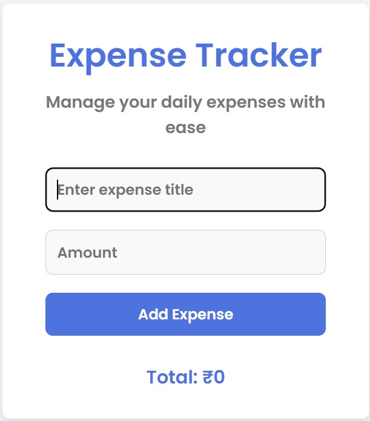

# 💸 Expense Tracker

Track your expenses easily and beautifully with this simple web application.  
Designed and developed by **Swastik Kesharwani** — passionate about web design and development!

---

## 📸 Demo



🔗 **Live Website:**  
[View Project](https://devine-swastik.github.io/Expense-Tracker/) (Coming soon after GitHub Pages setup)

---

## 🛠 Features

- Add and track your daily expenses
- Dynamic expense calculation
- Beautiful and responsive UI
- Clean code and mobile-friendly
- Easy to customize
- Built with HTML, CSS, and JavaScript

---

## 🚀 Technologies Used

- HTML5
- CSS3
- JavaScript (Vanilla)
- Google Fonts: Roboto, Poppins

---

## 📂 Project Structure

```
Expense-Tracker/
│
├── css/
│   └── style.css          # Styling
│
├── images/
│   ├── expense-tracker-demo.jpg  # Demo Screenshot
│
├── js/
│   └── app.js             # JavaScript logic
│
├── index.html             # Main HTML file
│
└── README.md              # Project documentation
```

---

## 📲 Installation

1. Clone this repository:

   ```bash
   git clone https://github.com/Devine-swastik/Expense-Tracker.git
   ```

2. Open the `index.html` file in your browser.

3. Start tracking your expenses!

---

## 👨‍💻 Author

**Swastik Kesharwani**  
📧 Email: [swastikkesharwani029@gmail.com](mailto:swastikkesharwani029@gmail.com)  
📱 Phone: +91 7307503719  
🌐 GitHub: [Devine-swastik](https://github.com/Devine-swastik)

---

## ⭐ Contribute

Feel free to fork, contribute, and make this project even better! Pull requests are always welcome.

---

## 🎨 Special Thanks

Thanks to **open source** communities and inspiration from modern web design trends.

---

# ✨ License

This project is licensed for personal or educational use.  
(Feel free to give credits when using!)

---
